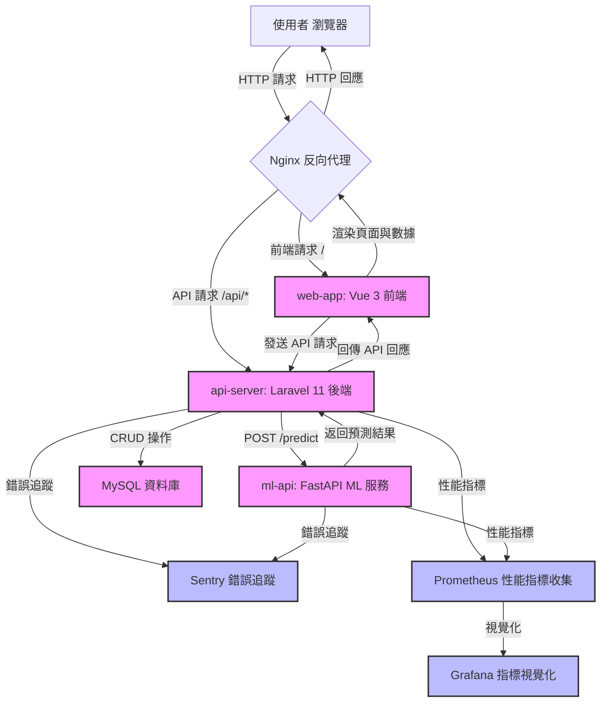

# DeliverPredictor

**DeliverPredictor** 是一個基於微服務架構的配送風險預測系統，旨在通過分析外送員的歷史數據（如逾期次數、請假頻率、平均配送時間、評分等）生成風險分數，並提供是否替換外送員的建議。系統將前端展示、後端業務邏輯和機器學習預測分離，實現高效、可擴展的服務架構。

## 專案亮點

- **模組化微服務架構**：系統分為 `web-app`（前端）、`api-server`（後端）和 `ml-api`（機器學習服務），各服務獨立開發與部署，確保靈活性與可維護性。
- **現代化技術棧**：
  - **前端**：Vue 3、Pinia、Vite、Chart.js，提供流暢的用戶體驗與數據視覺化。
  - **後端**：Laravel 11、PHP 8.2+、MySQL，實現穩定的業務邏輯與數據管理。
  - **機器學習**：FastAPI、Python 3.9+、Scikit-learn，提供高效的風險預測功能。
- **容器化部署**：使用 Docker Compose 實現一鍵部署，支援多平台（Linux/amd64、Linux/arm64）。
- **監控與 CI/CD**：
  - 整合 Sentry 進行錯誤追蹤，Prometheus 收集性能指標。
  - GitHub Actions 實現自動化測試與容器映像構建，確保程式碼品質。
- **可擴展性**：支援未來新增功能，如 Laravel Reverb 實時通訊或更複雜的 ML 模型。

## 系統架構

以下是系統架構圖，使用 Mermaid 語法繪製，展示各服務之間的交互流程：



**架構說明**：
- **使用者** 通過瀏覽器發送 HTTP 請求至 `Nginx`，由其分發至 `web-app` 或 `api-server`。
- **web-app** 負責前端渲染，通過 API 與 `api-server` 交互。
- **api-server** 處理業務邏輯，與 `ml-api` 通信以獲取風險預測，並與 `MySQL` 進行數據操作。
- **ml-api** 使用預訓練模型進行風險預測。
- **監控服務**（Sentry、Prometheus、Grafana）收集錯誤和性能指標。

## 技術棧

- **前端**：Vue 3, Pinia, Vue Router, Chart.js, Vite, Vitest
- **後端**：Laravel 11, PHP 8.2+, MySQL, Sentry, Prometheus
- **機器學習**：FastAPI, Python 3.9+, Scikit-learn, joblib, Sentry, Prometheus
- **部署**：Docker, Docker Compose, Nginx, GitHub Actions

## 關鍵程式碼片段

以下是專案中各模組的核心程式碼，附上中文註解，展示系統如何協同工作。

### 1. 後端：`api-server/app/Http/Controllers/PredictController.php`

```php
<?php

namespace App\Http\Controllers;

use Illuminate\Http\Request;
use Illuminate\Support\Facades\Http;

class PredictController extends Controller
{
    /**
     * 將預測請求轉發到 ML 服務並處理回應。
     */
    public function predict(Request $request)
    {
        // 定義 ML 服務的 API 端點
        $mlServiceUrl = 'http://ml-api:8000/predict';
        
        try {
            // 使用 Guzzle HTTP 客戶端發送 POST 請求到 ML 服務
            $response = Http::timeout(10)->post($mlServiceUrl, $request->all());

            // 若 ML 服務回應錯誤，拋出異常
            $response->throw();

            // 返回 ML 服務的 JSON 回應
            return response()->json($response->json());
        } catch (\Exception $e) {
            // 處理異常情況，返回錯誤訊息
            return response()->json([
                'message' => 'Failed to get prediction from ML service.',
                'error' => $e->getMessage()
            ], 500);
        }
    }
}
```

**說明**：此控制器接收前端的預測請求，轉發給 `ml-api` 的 `/predict` 端點，並處理回應或錯誤。

### 2. 機器學習服務：`ml-api/main.py`

```python
from fastapi import FastAPI
from pydantic import BaseModel
import joblib
import os
from prometheus_client import Counter, generate_latest

# 初始化 FastAPI 應用
app = FastAPI()

# 載入預訓練的 LogisticRegression 模型
model = joblib.load('model.pkl')

# Prometheus 計數器，用於追蹤預測請求數量
PREDICT_REQUESTS = Counter('predict_requests_total', 'Total number of predict requests.')

# 定義輸入數據的 Pydantic 模型
class CourierData(BaseModel):
    past_late_count: int
    leave_frequency: int
    avg_delivery_time: float
    rating: float

# 定義 /predict 端點，處理風險預測
@app.post("/predict")
def predict_risk(data: CourierData):
    PREDICT_REQUESTS.inc()  # 增加 Prometheus 計數器
    
    # 準備模型輸入特徵
    features = [[data.past_late_count, data.leave_frequency, data.avg_delivery_time, data.rating]]
    
    # 使用模型預測風險
    prediction = model.predict(features)[0]
    risk_score = model.predict_proba(features)[0][1]  # 取得高風險機率
    
    # 判斷是否建議替換外送員
    recommend_replacement = risk_score > 0.5
    
    # 返回預測結果
    return {
        "courier_id": "C001",
        "risk_score": round(risk_score, 2),
        "recommend_replacement": bool(recommend_replacement)
    }
```

**說明**：此程式碼定義了 FastAPI 的 `/predict` 端點，接收外送員數據，載入預訓練模型進行風險預測，並返回風險分數與建議。

### 3. 前端：`web-app/src/views/Dashboard.vue`

```vue
<template>
  <div>
    <h2>外送員風險儀表板</h2>
    <div v-if="store.loading">
      <p>正在從後端 API 取得預測結果...</p>
    </div>
    <div v-else-if="store.error">
      <p style="color: red;">載入失敗: {{ store.error }}</p>
    </div>
    <div v-else-if="store.predictionResult">
      <h3>外送員 #{{ store.predictionResult.courier_id }} 預測結果</h3>
      <RiskCard :score="store.predictionResult.risk_score" />
      <p>是否推薦替換：{{ store.predictionResult.recommend_replacement ? '是' : '否' }}</p>
      
      <!-- 風險分數圓環圖 -->
      <div style="width: 300px; margin: 2rem auto;">
        <canvas ref="riskChart"></canvas>
      </div>
    </div>
  </div>
</template>

<script setup>
import { ref, onMounted, watch } from 'vue';
import { useCourierStore } from '../store/useCourierStore.js';
import RiskCard from '../components/RiskCard.vue';
import Chart from 'chart.js/auto';

const store = useCourierStore();
const riskChart = ref(null);
let myChart;

// 創建風險分數圓環圖
const createChart = (score) => {
  if (myChart) {
    myChart.destroy(); // 銷毀舊圖表
  }
  myChart = new Chart(riskChart.value, {
    type: 'doughnut',
    data: {
      labels: ['風險分數', '剩餘'],
      datasets: [{
        data: [score, 1 - score],
        backgroundColor: [
          score > 0.7 ? 'red' : (score > 0.4 ? 'orange' : 'green'),
          '#e0e0e0'
        ],
        hoverOffset: 4
      }]
    },
    options: {
      responsive: true,
      plugins: {
        legend: { display: false }
      }
    }
  });
};

// 在元件掛載時觸發預測請求
onMounted(() => {
  store.fetchPrediction();
});

// 監聽預測結果，更新圖表
watch(() => store.predictionResult, (newResult) => {
  if (newResult) {
    createChart(newResult.risk_score);
  }
});
</script>
```

**說明**：此 Vue 元件展示風險預測結果，使用 Chart.js 繪製圓環圖，並通過 Pinia 狀態管理與後端 API 交互。

## 安裝與執行

### 先決條件

- Docker 和 Docker Compose
- Node.js 18+（用於本地開發）
- PHP 8.2+ 和 Composer（用於後端開發）
- Python 3.9+（用於 ML 服務開發）

### 設置步驟

1. **複製專案**
   ```bash
   git clone <your-repo-url>
   cd deliverpredictor
   ```

2. **啟動服務**
   ```bash
   docker-compose up -d --build
   ```

3. **初始化資料庫**
   ```bash
   docker-compose exec api-server php artisan migrate
   docker-compose exec api-server php artisan db:seed
   ```

4. **訪問應用**
   - 前端：`http://localhost:80`
   - 後端 API：`http://localhost:80/api`
   - ML API：`http://localhost:8000`

5. **運行測試**
   - 後端：`docker-compose exec api-server ./vendor/bin/phpunit`
   - ML API：`docker-compose exec ml-api pytest tests/`
   - 前端：`cd web-app && npm run test`

### 環境變數

- 複製 `api-server/.env.example` 到 `api-server/.env`，並設置：
  - `APP_KEY`：運行 `php artisan key:generate` 生成。
  - `SENTRY_DSN`：若使用 Sentry，設置監控 DSN。
  - `DB_HOST`, `DB_DATABASE`, `DB_USERNAME`, `DB_PASSWORD`：MySQL 連線資訊。
- 在 `docker-compose.yml` 中設置 `SENTRY_DSN_SECRET`。

## 常見問題與解答

以下是開發者可能遇到的常見問題及其解答，幫助快速理解與使用專案。

### 1. 如何新增更多的外送員數據？
   - **解答**：外送員數據儲存在 `api-server` 的 MySQL 資料庫中，表名為 `couriers`。可通過以下方式新增數據：
     - 使用 Laravel 的 Seeder：編輯 `api-server/database/seeders/CouriersTableSeeder.php`，新增數據並運行：
       ```bash
       docker-compose exec api-server php artisan db:seed
       ```
     - 直接操作資料庫：連線到 MySQL（`docker-compose exec mysql mysql -u root -p`），插入數據到 `couriers` 表。
     - 未來可開發 API 端點（如 `POST /api/couriers`）以支援前端新增數據。

### 2. 如何訓練新的 ML 模型？
   - **解答**：ML 模型訓練程式碼位於 `ml-api/train.py` 和 `ml-api/notebooks/training.ipynb`。步驟如下：
     1. 修改 `train.py` 或 `training.ipynb` 中的數據集（目前為簡單假數據）。
     2. 運行訓練腳本：
        ```bash
        docker-compose exec ml-api python train.py
        ```
     3. 新生成的 `model.pkl` 會自動被 `ml-api/main.py` 載入。
     - 建議使用 Jupyter Notebook（`training.ipynb`）進行實驗，支援互動式數據分析與模型調參。

### 3. 如果 API 請求失敗，如何排查？
   - **解答**：
     - 檢查 `api-server` 日誌：`api-server/storage/logs/laravel.log`。
     - 檢查 `ml-api` 是否運行正常：`docker-compose logs ml-api`。
     - 確保環境變數正確（`api-server/.env` 中的 `DB_HOST` 和 `docker-compose.yml` 中的服務連線）。
     - 使用 Sentry 查看錯誤詳情（若已配置 `SENTRY_DSN`）。
     - 測試 API 端點：使用工具如 Postman 發送 `POST http://localhost:80/api/predict`。

### 4. 如何自訂前端儀表板的顯示？
   - **解答**：前端儀表板位於 `web-app/src/views/Dashboard.vue`。可修改：
     - **樣式**：調整 `<style>` 區塊或新增 CSS 檔案。
     - **圖表**：修改 `createChart` 函數，使用 Chart.js 的其他圖表類型（如柱狀圖）。
     - **數據**：在 `web-app/src/store/useCourierStore.js` 中修改 `fetchPrediction` 函數，調整 API 請求參數。
     - 重新構建前端：`cd web-app && npm run build`。

### 5. 如何擴展監控功能？
   - **解答**：
     - **Prometheus**：編輯 `api-server/app/Http/Controllers/MetricsController.php` 和 `ml-api/main.py`，新增更多指標（如 API 延遲）。
     - **Grafana**：修改 `grafana/dashboard.json`，新增面板以視覺化新指標。
     - **Sentry**：確保 `SENTRY_DSN` 已配置，檢查 Sentry 儀表板以查看錯誤趨勢。
     - 可考慮新增其他監控工具（如 ELK Stack）以收集日誌。

### 6. 如何部署到生產環境？
   - **解答**：
     1. 更新 `docker-compose.yml` 中的映像標籤（`yourdockerhub/deliverpredictor-*`）並推送至 Docker Hub：
        ```bash
        docker-compose build
        docker-compose push
        ```
     2. 在生產伺服器上配置環境變數（特別是 `APP_KEY` 和 `SENTRY_DSN`）。
     3. 使用 `docker-compose up -d` 部署。
     4. 設定反向代理（如 Nginx 或 Traefik）以處理外部流量。
     - 建議使用 Kubernetes 或 ECS 進行容器編排，以支援高可用性。

## 未來改進

- **模型優化**：引入更複雜的 ML 模型（如 XGBoost）或更多特徵。
- **實時功能**：整合 Laravel Reverb 實現即時風險更新。
- **高級監控**：擴展 Prometheus 和 Grafana 的儀表板，監控更多指標。
- **身份驗證**：新增完整的用戶身份驗證與權限管理。

## 貢獻

歡迎提交問題或 PR！請遵循以下步驟：
1. Fork 專案
2. 創建特性分支 (`git checkout -b feature/YourFeature`)
3. 提交變更 (`git commit -m 'Add YourFeature'`)
4. 推送到分支 (`git push origin feature/YourFeature`)
5. 開啟 Pull Request

## 授權

本專案採用 MIT 授權，詳見 `LICENSE` 文件。
